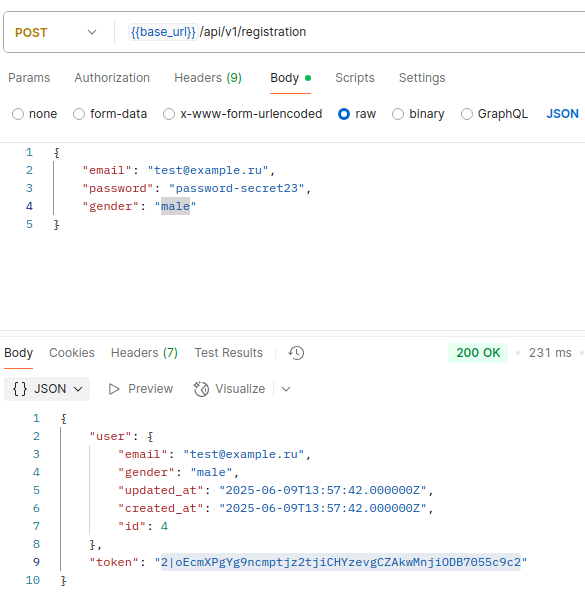
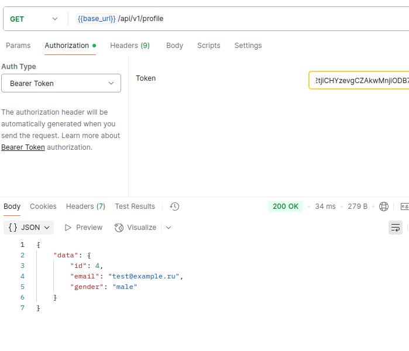

# Laravel API Test Project

## Описание проекта

Этот проект реализует базовый API для регистрации пользователя и получения его профиля.  
Основные возможности:

- Регистрация нового пользователя с параметрами: `email`, `password`, `gender`.
- Получение данных профиля авторизованного пользователя (`email`, `gender`).
- Использование Laravel Sanctum для аутентификации через токены.
- Валидация входящих данных через кастомные FormRequest.
- Пример структуры API с версионированием маршрутов (`api/v1`).

---

## Запуск проекта

1. Клонируйте репозиторий и установите зависимости:

    ```bash
    composer install
    ```

2. Настройте `.env` (базу данных, mail и т.д.).
   ```bash
    cp .env.real .env
    ```

3. Запустите миграции:

    ```bash
    php artisan migrate
    ```

4. Запустите сервер:

    ```bash
    php artisan serve
    ```

---

## API эндпоинты

| Метод | URL                    | Описание                                               |
|-------|------------------------|--------------------------------------------------------|
| POST  | `/api/v1/registration` | Регистрация нового пользователя                        |
| GET   | `/api/v1/profile`      | Получение профиля текущего пользователя (Bearer токен) |

---

## Postman

Для тестирования API доступна Postman коллекция:  
[postman/Test API.postman_collection.json](postman/Test API.postman_collection.json)

### Скриншоты запросов

- Регистрация пользователя:  
  

- Получение профиля пользователя:  
  
